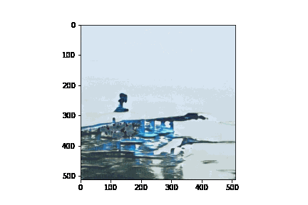

# StyleGan-machine-learning-art-first-example

# StyleGAN landscapes using Runway ML

Using the file `stylegan_landscaped_runway.ipynb` we are able to generate landscapes and nicely transition between different ones using the Runway ML API.